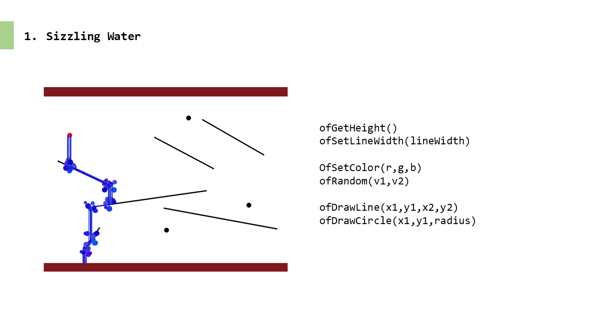

## COMSIL-1 | WATER FALL

### feature

1. sizzling water 물 와글와글 효과넣기

2. change line mode 선분 위치 바꾸기

3. night mode 밤 모드 (별 반짝반짝)

4. refactor 코드 개선

   a) 동일 키 두 번 누르면 행동 종료

   b) 고정된 backgroud는 ofFbo 활용(매번 draw()하지 않도록)

   c) 기능별 모듈화

   d) 변수명 및 함수명 변경

### 1. sizzling water

### 2. change line

### 3. night mode

